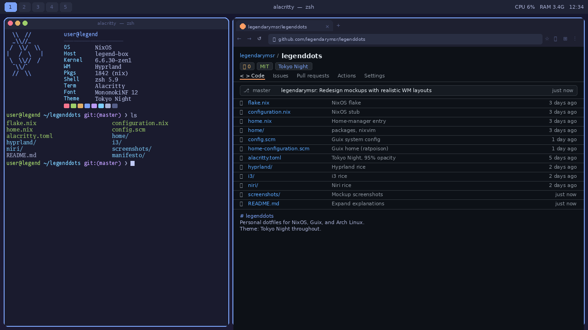
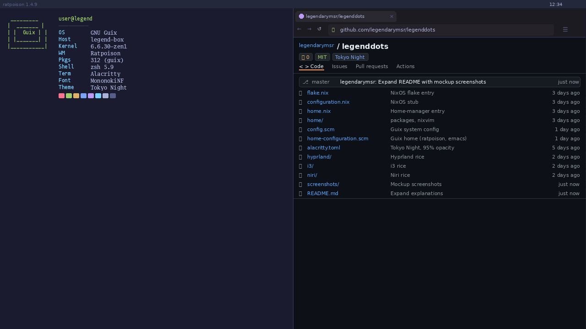
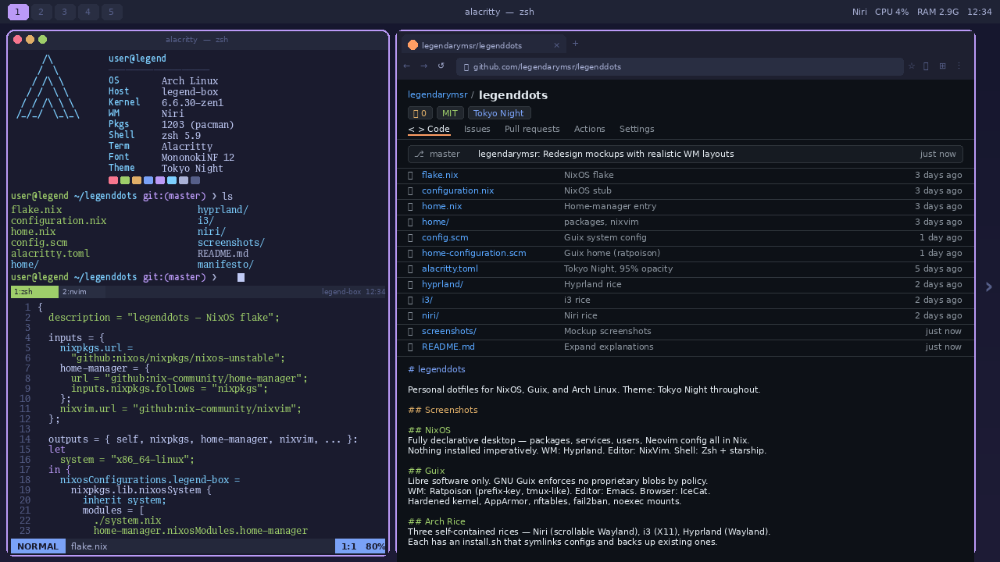
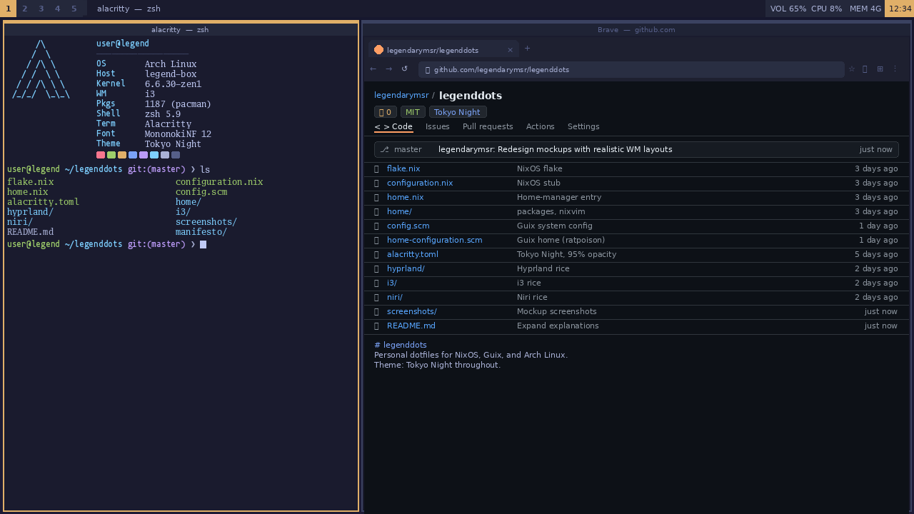
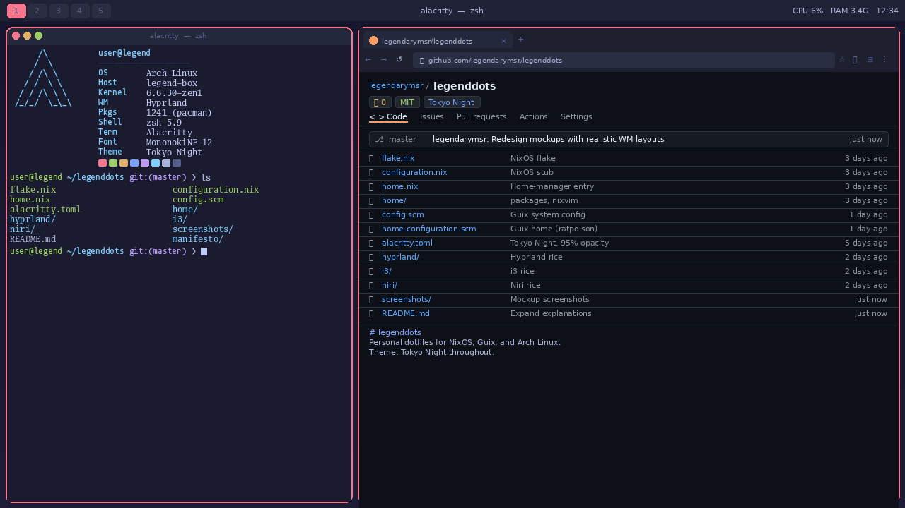

# legenddots

Personal dotfiles for NixOS, Guix, and Arch Linux. Theme: **Tokyo Night** throughout.

---

## Screenshots

### NixOS — Hyprland


### Guix — Ratpoison


### Arch — Niri


### Arch — i3


### Arch — Hyprland


---

## Browsers

| Config | Browser |
|--------|---------|
| NixOS | `brave` (nixpkgs, stable — nightly not in nixpkgs) |
| Guix | `icecat` (GNU, fully libre) |
| Arch rices | `brave-origin-nightly-bin` (AUR), installed by each `install.sh` |

---

## Structure

```
legenddots/
├── flake.nix                  NixOS flake entry
├── system.nix                 NixOS system config (users, security, services, kernel)
├── configuration.nix          NixOS stub
├── home.nix                   Home-manager entry
├── home/
│   ├── packages.nix           Package list
│   └── nixvim.nix             Neovim via NixVim
│
├── config.scm                 Guix system config
├── home-configuration.scm     Guix home config (ratpoison, zsh, emacs, dotfiles)
│
├── init.lua                   Neovim config
├── init.el                    Emacs config
├── alacritty.toml             Terminal (Tokyo Night, 95% opacity)
│
├── niri/                      Niri rice (Wayland)
│   ├── config.kdl
│   ├── waybar/
│   ├── fuzzel/
│   ├── dunst/
│   ├── swaylock/
│   └── install.sh
│
├── i3/                        i3 rice (X11)
│   ├── config
│   ├── picom.conf
│   ├── polybar/
│   ├── rofi/
│   └── install.sh
│
└── hyprland/                  Hyprland rice (Wayland)
    ├── hyprland.conf
    ├── hyprpaper.conf
    ├── hyprlock.conf
    ├── waybar/
    └── install.sh
```

---

## Manifesto

Your editor should not phone home. Your OS should not require a Microsoft account. Your tools should not need 40GB of RAM to open a text file.

Every package here is auditable. Every config is version controlled. Nothing runs that wasn't explicitly put there.

- Proprietary software is a liability, not a feature.
- If you can't read the source, you don't own the tool.
- Reproducibility is a security property.
- Bloat is attack surface.

The manifesto page lives in `manifesto/` — open `index.html` locally.

---

## NixOS

The NixOS setup is a fully declarative desktop. Everything — packages, services, users, kernel params, Neovim config — is described in Nix files and reproducible from scratch with one command. Nothing is installed imperatively; if it's not in the config, it doesn't exist on the system.

- **WM**: Hyprland (Wayland) — animated, gesture-friendly, good hardware acceleration
- **Editor**: Neovim via NixVim (declarative Lua config managed by home-manager)
- **Shell**: Zsh with starship prompt
- **Bar**: Waybar
- **Launcher**: Fuzzel
- **Notifications**: Dunst
- **Lock**: Hyprlock
- **Theme**: Tokyo Night throughout

```bash
nixos-rebuild switch --flake .#legend-box
```

Home-manager is integrated into the flake. NixVim handles Neovim declaratively — plugins, LSPs, and keymaps are all in `home/nixvim.nix`, no manual `:PackerSync` or `:Mason` needed.

---

## Guix

The Guix setup is the most minimal and principled of the three. GNU Guix enforces libre software by policy — no proprietary blobs, no non-free firmware, no nonfree package channels by default. The entire system is reproducible and rollback-able, similar to NixOS but with Scheme (Guile) instead of Nix expressions.

- **WM**: Ratpoison — a keyboard-driven, zero-chrome tiling WM. No taskbar, no decorations, no mouse needed. Every window is fullscreen or split. All commands go through a prefix key (`C-t`), like Tmux for your desktop.
- **Editor**: Emacs — configured in `init.el`, treated as the primary environment (shell, file manager, git UI, etc.)
- **Browser**: Icecat — GNU's fully libre Firefox fork, no telemetry, no proprietary codecs
- **Shell**: Zsh
- **Lock**: slock (suckless, zero UI — screen goes black, type password)
- **Security**: Hardened kernel args, AppArmor, nftables firewall, fail2ban, noexec mounts on `/tmp` and `/run`
- **Theme**: Tokyo Night (Emacs theme, terminal colors)

```bash
# System
guix system reconfigure config.scm

# Home
guix home reconfigure home-configuration.scm
```

Ratpoison is configured entirely through `~/.ratpoisonrc` (managed by Guix home). The Emacs config in `init.el` is standalone — no package manager bootstrapping, packages are declared in the Guix home config.

---

## Arch Rice

Three self-contained Arch rices sharing the same theme and keybind philosophy. Each lives in its own directory with an `install.sh` that symlinks configs and backs up anything already in place. Requires `paru` or `yay` for AUR packages.

### Niri (Wayland)

A scrollable-tiling Wayland compositor. Windows tile horizontally into an infinite scrolling canvas — no fixed workspaces, just scroll left and right through open windows. Feels like a spatial desktop.

- **Bar**: Waybar
- **Launcher**: Fuzzel
- **Notifications**: Dunst
- **Lock**: Swaylock

```bash
bash niri/install.sh
```

Requires `waybar-git` from AUR (for niri-specific workspace support).

### i3 (X11)

Classic manual tiling on X11. Splits windows horizontally or vertically on demand, fully keyboard-driven. The most stable and widely supported of the three — runs on any hardware, any GPU driver.

- **Bar**: Polybar
- **Launcher**: Rofi
- **Compositor**: Picom (blur, transparency, shadows)
- **Theme**: Tokyo Night via Xresources + Rofi theme

```bash
bash i3/install.sh
```

### Hyprland (Wayland)

Animated dynamic tiling on Wayland. Windows tile automatically with smooth animations and workspace transitions. Supports gestures, per-window rules, and blur/shadow effects natively.

- **Bar**: Waybar
- **Launcher**: Fuzzel (via Hyprland exec)
- **Lock**: Hyprlock
- **Wallpaper**: Hyprpaper

```bash
bash hyprland/install.sh
```

Install scripts symlink configs and back up any existing ones.

---

## Terminal

`alacritty.toml` — Tokyo Night, JetBrainsMono Nerd Font, 95% opacity.

---

## Keybinds

Arch rices (niri, i3, hyprland) use `Mod` (Super) for keybinds.

Guix/ratpoison works differently — every bind goes through a **prefix key** (`C-t`, i.e. Ctrl+t), then a second key. There is no held modifier. Think of it like Tmux.

| Action | Arch (`Mod+`) | Guix (`C-t` then) |
|--------|--------------|-------------------|
| Terminal | `Return` | `c` |
| Launcher | `d` | `d` |
| Browser | `b` | `b` |
| Emacs | — | `e` |
| Close window | `Shift+q` | `q` |
| Exit | `q` | `Q` |
| Focus directional | `h/j/k/l` | `h/j/k/l` |
| Cycle focus | `Tab` | `n` / `p` |
| Move window | `Shift+h/j/k/l` | `H/J/K/L` |
| Switch workspace | `1-9` | `1-9` |
| Move window to workspace | `Shift+1-9` | `!/@/#/$/%/^/&/*/( ` |
| Lock screen | `Escape` | `Escape` |
| Screenshot | `Print` | `Print` |

### Ratpoison notes

- **Workspaces are called groups** in ratpoison. `C-t 1` switches to group 1. Groups must exist before you can switch — ratpoison creates them on first use.
- **Moving windows between groups**: `C-t !` moves the current window to group 1, `C-t @` to group 2, and so on (Shift+number).
- **Lock screen** uses `slock` — a minimal suckless screen locker. Screen goes black, type password to unlock, no UI.
- **Focus** is directional (`hjkl`) when windows are split, or use `C-t n`/`C-t p` to cycle through all windows.
